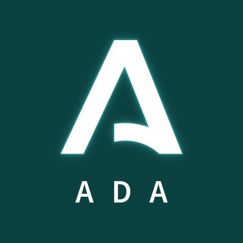

# Presentaciones duales de 1º DAW y 1º DAM del curso 2023 / 2024

Horarios, índices a las carpetas y normas para las presentaciones de alumnos duales de **1º DAM** (Desarrollo de Aplicaciones Multiplataforma) y **1º DAW** (Desarrollo de Aplicaciones Web) del **CPIFP Alan Turing** (Málaga - PTA) del curso 2023 - 2024.

## Índice

* [Cuadrante horario de las presentaciones con índices a las carpetas](#cuadrante-horario-de-las-presentaciones-con-índices-a-los-repositorios)
* [Tiempo para la presentación](#stopwatch-tiempo-para-la-presentación)
* [Contenido de la presentación](#open_file_folder-contenido-de-la-presentación)
* [Formato de la presentación](#bookmark_tabs-formato-de-la-presentación)
* [Lugar de la presentación](#school-lugar-de-la-presentación)

## Cuadrante horario de las presentaciones con índices a los repositorios

Cada alumno debe enlazar con el repositorio donde tiene su presentación (formato elegido y pdf), además de cualquier otra información que considere relevante.

### :calendar: Lunes 27 de mayo de 2024 - Turno de mañana

* Hora de comienzo: 11:45h

##### 1ºDAW

* [Colomer, Bárbara Palmira](enlace-al-repositorio-con-el-material)
* [Lázaro Zambrano, Gonzálo](enlace-al-repositorio-con-el-material)
* [Ramos Alarcón, Sergio](enlace-al-repositorio-con-el-material)

##### 1ºDAM

* [Leiva López, Eloy](enlace-al-repositorio-con-el-material)

* Hora de comienzo: 12:15h

##### 1º DAW

* [López Guerrero, Álvaro](enlace-al-repositorio-con-el-material)
* [Chacón Macías, Juan Francisco](enlace-al-repositorio-con-el-material)
* [Alarcón Fortes, Manuel](enlace-al-repositorio-con-el-material)

##### 1º DAM
* [Lázaro Zambrano, Ignacio](enlace-al-repositorio-con-el-material)
* [Avella Pérez, Samuel](enlace-al-repositorio-con-el-material)

* Hora de comienzo: 12:50h

##### 1º DAW

* [Leiva García, Álvaro](enlace-al-repositorio-con-el-material)
* [Barnestein Martos, Alejandro](enlace-al-repositorio-con-el-material)
* [Avila Rosas, Miguel Ángel](enlace-al-repositorio-con-el-material)

* Hora de comienzo: 13:15h

##### 1ºDAM

* [Solera Romero, David](enlace-al-repositorio-con-el-material)

* Hora de comienzo: 13:30h

##### 1º DAM

* [Gallego Ríos, Boris](enlace-al-repositorio-con-el-material)

### :calendar: Lunes 27 de mayo de 2024 - Turno de tarde

* Hora de comienzo: 15:15h

##### 1ºDAW

* [Molina Meléndez, José](enlace-al-repositorio-con-el-material)

##### 1ºDAM

* [Domínguez García, Héctor](enlace-al-repositorio-con-el-material)

* Hora de comienzo: 15:35h

##### 1º DAW

* [López Bermúdez, Raquel](enlace-al-repositorio-con-el-material)
* [Barrionuevo Rosado, Alejandro](enlace-al-repositorio-con-el-material)

##### 1º DAM
* [Rico Navarro, Javier](enlace-al-repositorio-con-el-material)
* [Cabello Sánchez, Alba](enlace-al-repositorio-con-el-material)

* Hora de comienzo: 16:05h

##### 1º DAW

* [Ruiz Domínguez, Pablo](enlace-al-repositorio-con-el-material)
* [Ruiz Cosano, Juan Ignacio](enlace-al-repositorio-con-el-material)
* [García Alcalá, Miguel](enlace-al-repositorio-con-el-material)
* [Capote Molina, Enrique](enlace-al-repositorio-con-el-material)

* Hora de comienzo: 16:35h

##### 1ºDAW

* [Sánchez Caparrós, Antonio Francisco](enlace-al-repositorio-con-el-material)

* Hora de comienzo: 16:50h

##### 1ºDAW

* [Cabello Rueda, Francisco Javier](enlace-al-repositorio-con-el-material)

* Hora de comienzo: 17:05h

##### 1ºDAW

* [Robles Ruiz, Elías](enlace-al-repositorio-con-el-material)

* Hora de comienzo: 17:20h

##### 1ºDAM

* [Carmona Gálvez, Adrián](enlace-al-repositorio-con-el-material)

* Hora de comienzo: 17:35h

##### 1ºDAM 

* [Atencia Barranco, Paula](enlace-al-repositorio-con-el-material)

## :stopwatch: Tiempo para la presentación

Los alumnos de la misma empresa deberán de realizar una presentación común de la misma cuya duración será de 5 minutos como máximo. A continuación, cada alumno realizará una presentación individualizada de su trabajo de 5 minutos, dejando otros 5 minutos para un turno de preguntas común.

## :open_file_folder: Contenido de la presentación

La presentación debe tener, como mínimo, el siguiente contenido:

* Introducción a la empresa. Se debe hacer en común cuando en la misma empresa hay varios alumnos.
* Tareas desempeñadas con temporalización por semanas.
* Herramientas utilizadas.
* Conocimientos adquiridos por cada módulo profesional.
* Valoración de la experiencia dual por parte del alumno.

## :bookmark_tabs: Formato de la presentación

Se puede utilizar cualquier herramienta para elaborar la presentación. El alumno se puede apoyar en material multimedia si lo considera oportuno.

Independientemente de la herramienta utilizada para crear y mostrar la presentación, debe haber una versión en pdf en el repositorio.

Cualquier material utilizado en la presentación debe estar disponible desde el mismo repositorio: presentación original, presentación en formato pdf, enlaces a videos, etc.

## :school: Lugar de la presentación

Las presentaciones SON PRESENCIALES y tendrán lugar en el **Aula Ateca** sita en C/ Frederick Terman,3. 29590, PTA.

Si te ha resultado útil este repositorio, por favor dale una :star: ¡Gracias!

